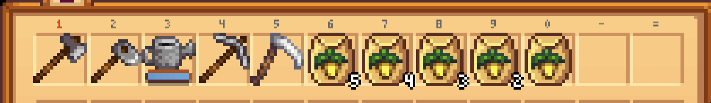
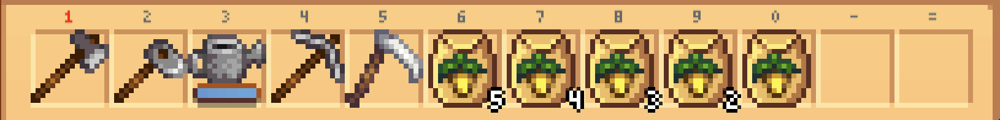

# Stardew Valley Metadata Covert Channel
Using the data of players in Stardew Valley to communicate a covert message.

## File Reader POC
This is the first proof of concept technique for a covert channel where the machine is reading from its own player data to get the message.

It uses inventory layout to send a lengthy message using a small amount of data.

The default starting inventory can be laid out as such to produce 6 different values.

But the parsnips can be split into multiple stacks allowing for an even greater variance of inventory layouts. 

Running the calculations there are 5,157,250,560 possible inventory layouts just with the starting items, which is a bit over 32 bits (4 bytes) of data. This means that by rearranging the hotbar we can transmit 4 bytes of data each time the game is saved.
